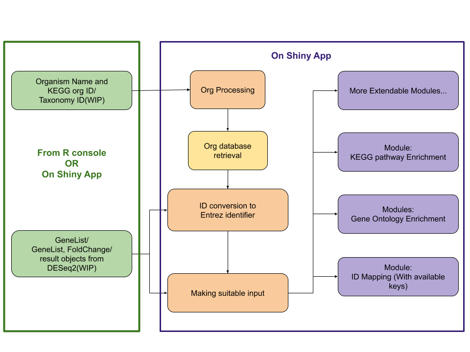

# sig-bio-shiny 

<!-- badges: start -->
  [](https://www.tidyverse.org/lifecycle/#experimental)
  [](https://github.com/sk-sahu/sig-bio-shiny/releases)
  [](https://travis-ci.org/sk-sahu/sig-bio-shiny)
  [](https://circleci.com/gh/sk-sahu/sig-bio-shiny)
[](https://github.com/sk-sahu/sig-bio-shiny/actions?workflow=R-CMD-check)
[](https://hub.docker.com/repository/docker/sudosk/sig-bio-shiny/builds)
[](https://zenodo.org/badge/latestdoi/220482361)
<!-- badges: end -->

An interactive application suite/interface for doing Exploration and Significant Biology on a set of Genes.


Above is a screen recoding of what can be done with the SigBio interface.

<details><summary>Try yourself?</summary>
<p>

Do it in your own computer system by following [installation instructions](#installation) or try one of the following methods.

For now this application requires atleast 4 GB of system memory. So couldn't able to host on shinyapps.io but instead with generous help of Rstudio now this project Rstudio Cloud instace is 4GB. So you can simply login with follwing project link and follow [run instructions](#run-the-app). 

[Try SigBio-Shiny in Rstudio-Cloud](https://rstudio.cloud/project/1023160)

</p>
</details>

---

Table Of Content

  - [Overview](#overview)
  - [Features](#features)
    - [TODO](#todo)
  - [Disclaimer](#disclaimer)
  - [Installation](#installation)
    - [Requirements](#requirements)
  - [Run the app](#run-the-app)
  - [Setup for Shiny-Server](#setup-for-shiny-server)
    - [With docker image](#with-docker-image)
  - [Contribution](#contribution)
    - [Developers Notes](#developers-notes)
    - [Code of Conduct](#code-of-conduct)

## Overview

The main motivation is to provide an easy interface to explore a Gene-set, without worrying about getting an organism database or conversion between particular R object which can be input to an available awesome R/Bioconductor package.

After downstream analysis of gene expression data, the end results are often a set of genes (may be a list of clustered genes, up/down regulated genes). To know their biological significance on a particular context (gene ontology or pathway) lot of statistical analysis available (Gene set enrichment, Over representation). Some awesome Bioconductor packages are developed for this purpose, But often the entry point might be difficult in some cases (mostly because of a particular input type). Also, besides that specifically for non-model organism it is little challenging.

Trying to solve these problems sig-bio-shiny is made. Completely made using R and Bioconductor. No manual database dump required, which make deployment simple with a single R Script. It takes full advantage of AnnotationHub package to get latest annotation for the selected organism and do statistical analysis on top of it using various well known packages.



## Features

* Model and Non-model organism support with [AnnotationHub](http://bioconductor.org/packages/release/bioc/html/AnnotationHub.html)
* Internal conversion of R objects for suitable input to a particular package/function/module.
* Modules
  * Gene mapping Annotation
  * Gene Ontology (GO) Enrichment
  * KEGG Pathway Enrichment

### TODO
* Reproducible code (#25)
* Report generation
* Support for DESeq2 results object as input.

## Disclaimer
sig-bio-shiny shiny application along with the SigBio R package is an open source effort and distributed under [MIT license](https://opensource.org/licenses/MIT). This uses KEGG data for few tasks, which is free for Academic uses but other uses may require a license agreement (In details at [KEGG Website](https://www.kegg.jp/kegg/legal.html)). By using this application you follow the respective tool licenses. Any developer involved in this DO NOT warrant nor responsible for any legal issues.

---

## Installation

### Requirements
R >= 3.5

From R console

```r
if (!require(remotes)) { install.packages("remotes") }
  remotes::install_github("sk-sahu/sig-bio-shiny")
```

## Run the app

Launch the app in browser.

```r
SigBio::runApp()
```

---

## Setup for Shiny-Server

First you need to install the SigBio package which have all the APIs required for most functionality in the shiny app.

Download the `app.R` file using wget from a specific app directory of your shiny-server.

```bash
wget https://raw.githubusercontent.com/sk-sahu/sig-bio-shiny/master/inst/app/app.R -O sig-bio-shiny-app.R
```

On the first time of running This will download and install all the required dependency.

### With docker image

```bash
docker pull sudosk/sig-bio-shiny:latest
docker run --user shiny --rm -p 80:3838 sudosk/sig-bio-shiny:latest
```
Accessed app in a browser at http://127.0.0.1

---

## Contribution 

First of all thank you for your interest in contributing to this project :) 

If you want to fix/report any bugs or add an extra module then please follow developer notes bellow. This will help us to maintain a specific structure to the project.

### Developers Notes

<details><summary> Expand </summary>
<p>
Try to keep `app.R` file minimal, only with essential lines of code. For each module, Server and UI functions should specify in a single R script (Example: `module_modulename.R`) and additional required functions for that modules should be in another file (Example: `module_modulename_utils.R`)

I'll extend this section in more detail. Till then please feel free to contact for more details.

Whenever depolying to shinyapps.io - [Ref](https://support.bioconductor.org/p/107298/)

```R
options(repos = BiocManager::repositories()) 
```
</p>
</details>

### Code of Conduct
  
Please note that the SigBio project is released with a [Contributor Code of Conduct](http://sk-sahu.github.io/sig-bio-shiny/CODE_OF_CONDUCT.html). By contributing to this project, you agree to abide by its terms.